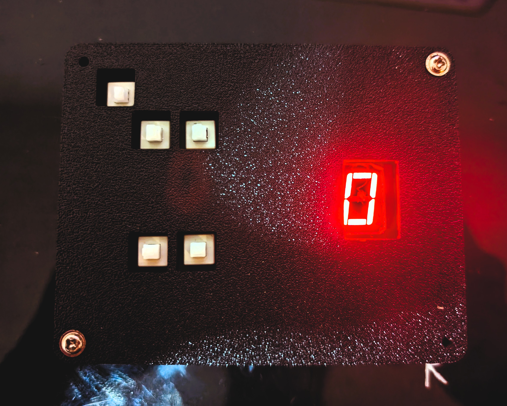
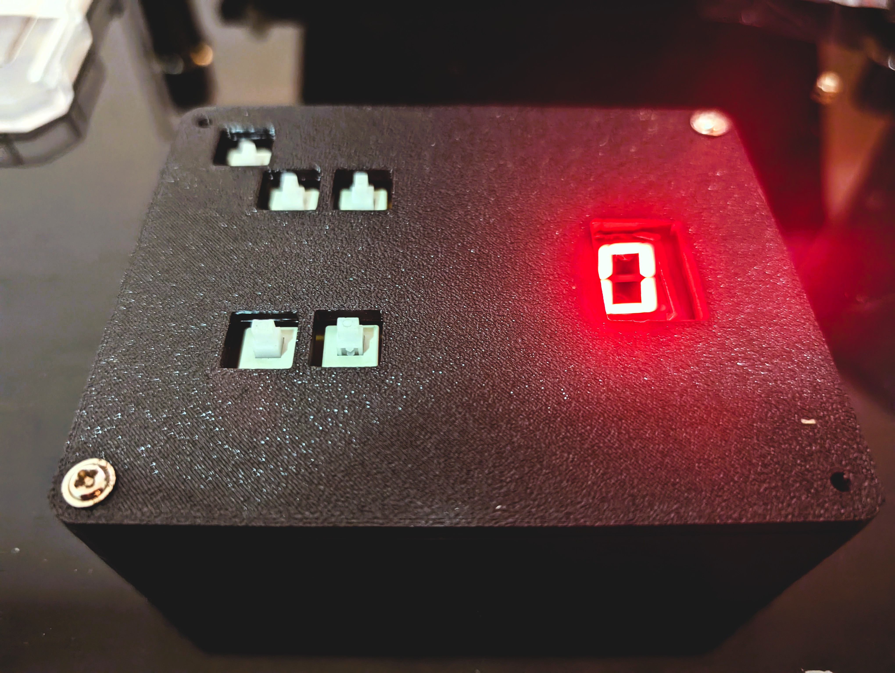
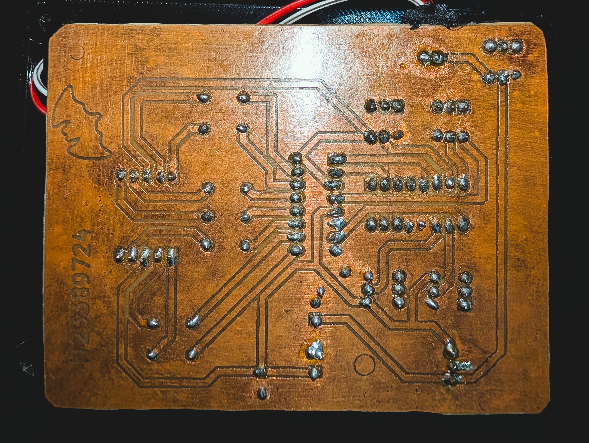
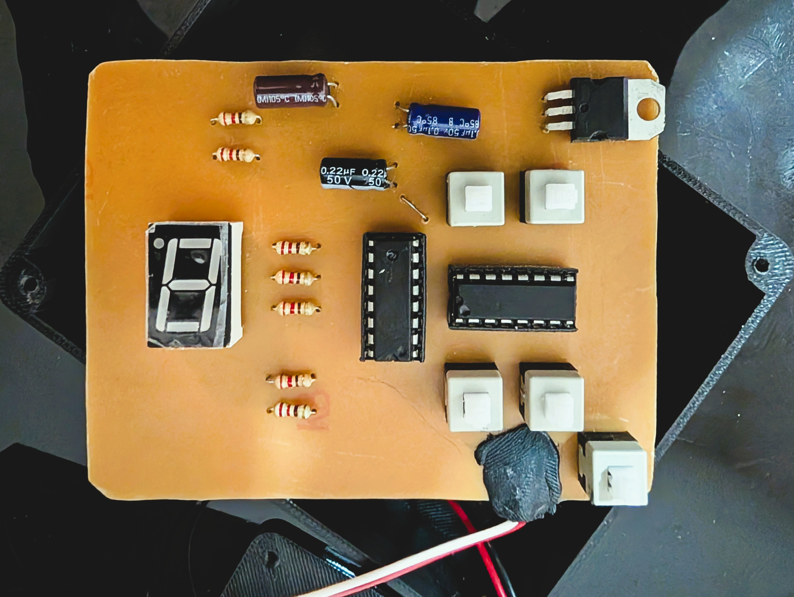
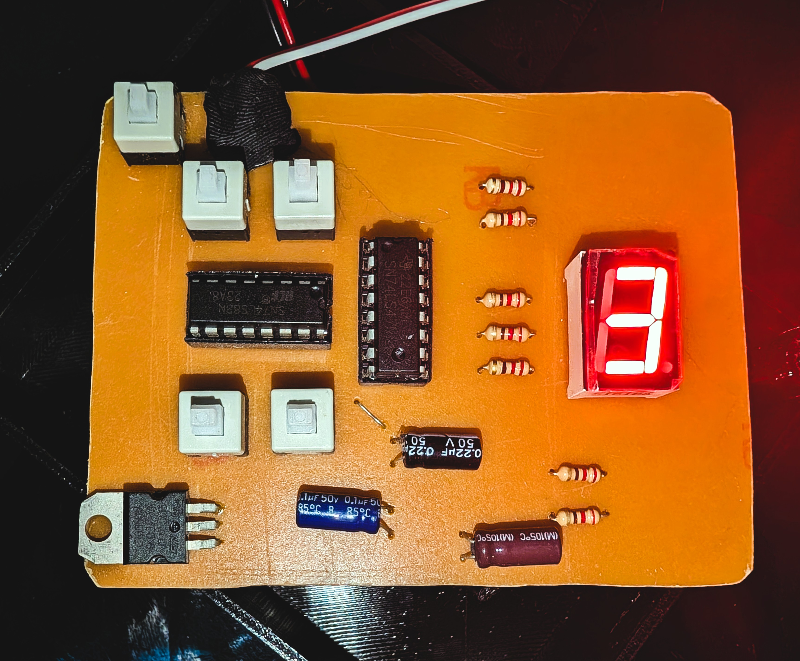
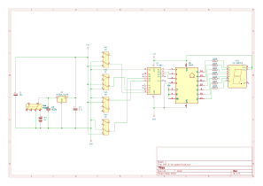
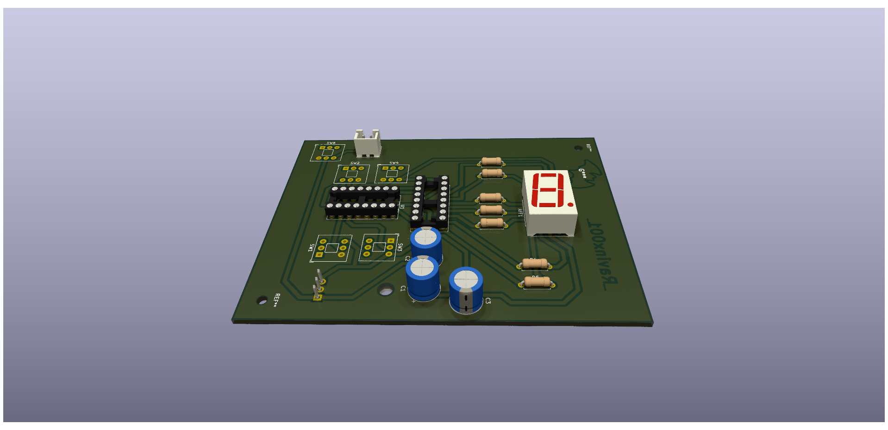
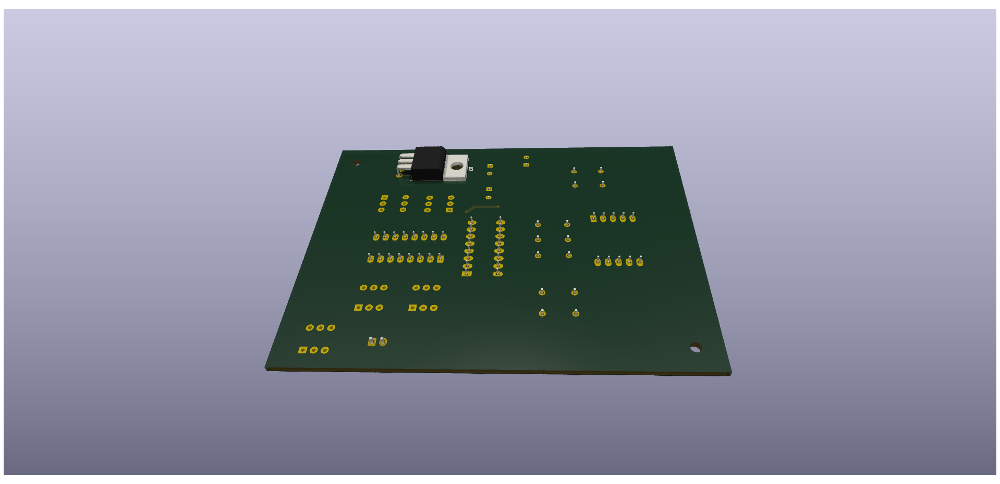

<div align="center">
  <h1>🔢 Battery-Powered 2-Bit Binary Adder</h1>
  
  ### ⚡ Traditional PCB Design & Fabrication Project
  
  **Complete Electronics Design Lifecycle**  
  *Schematic Design • Chemical Etching • 3D-Printed Enclosure*


<br>

  
  
  
  
</div>

---

## 🎯 Project Overview

A complete electronics design project demonstrating a **2-bit binary adder** built from the ground up. This project encompasses schematic design, PCB layout, traditional chemical etching fabrication, and a custom 3D-printed enclosure.

The device accepts two 2-bit binary numbers via toggle switches, calculates the sum using a 4-bit binary adder IC, and displays the decimal result on a 7-segment LED display.

**Goal:** To design and fabricate a functional printed circuit board (PCB) using traditional home-lab procedures and integrate it into a finished consumer-like product.

<div align="center">
  
  
  <br>
  
  
  
</div>

---

## ✨ Key Features & Capabilities

### 🔌 **TTL/CMOS Logic Design**
Built using industry-standard 74-series TTL and CMOS logic integrated circuits for reliable digital operation.

### 🧮 **2-Bit Binary Addition**
- Input Range: 0-3 (per input)
- Output Range: 0-6 (sum display)
- Real-time calculation with instant display update

### 🔋 **Portable Battery Power**
9V battery operation with regulated 5V logic level via LM7805 voltage regulator.

### 📟 **7-Segment LED Display**
Clear decimal output using BCD-to-7-segment decoder for easy reading.

### 🏭 **Traditional Fabrication**
Handcrafted PCB using toner transfer and chemical etching methods.

---

## 🛠️ Hardware Architecture

<div align="center">

| **Component** | **Part Number** | **Function** |
|---------------|-----------------|--------------|
| **Binary Adder** | 74LS83 | 4-bit Binary Full Adder (configured for 2-bit) |
| **BCD Decoder** | CD4511 | BCD-to-7-Segment Latch/Decoder/Driver |
| **Display** | LTS-6960HR | 7-Segment LED Display |
| **Voltage Regulator** | LM7805 | 9V to 5V Regulation |
| **Input Switches** | Toggle Switches x4 | A0, A1 and B0, B1 Binary Inputs |
| **Filter Capacitors** | 100µF, 0.1µF, 0.22µF | Power Noise Suppression |

</div>

### 📊 Circuit Block Diagram

```
┌─────────────────────────────────────────────────────────────────┐
│                         POWER SUPPLY                            │
│  ┌──────────┐    ┌──────────┐    ┌────────────────────────────┐ │
│  │ 9V       │───▶│ LM7805   │───▶│ Filter Caps (100µF/0.1µF)  │ │
│  │ Battery  │    │ Regulator│    │         5V Output          │ │
│  └──────────┘    └──────────┘    └────────────────────────────┘ │
└─────────────────────────────────────────────────────────────────┘
                              │
                              ▼ 5V
┌─────────────────────────────────────────────────────────────────┐
│                        INPUT STAGE                              │
│  ┌────────────────────┐    ┌────────────────────┐               │
│  │ Switches A0, A1    │    │ Switches B0, B1    │               │
│  │ (Number A: 0-3)    │    │ (Number B: 0-3)    │               │
│  └─────────┬──────────┘    └─────────┬──────────┘               │
└────────────┼─────────────────────────┼──────────────────────────┘
             │                         │
             ▼                         ▼
┌─────────────────────────────────────────────────────────────────┐
│                      PROCESSING STAGE                           │
│                    ┌────────────────────┐                       │
│    A0, A1 ────────▶│     74LS83         │                       │
│    B0, B1 ────────▶│  4-bit Full Adder  │───▶ S0, S1, S2 (Sum)  │
│                    └────────────────────┘                       │
└─────────────────────────────────────────────────────────────────┘
                              │
                              ▼
┌─────────────────────────────────────────────────────────────────┐
│                       OUTPUT STAGE                              │
│  ┌────────────────────┐    ┌────────────────────┐               │
│  │      CD4511        │───▶│    LTS-6960HR      │               │
│  │  BCD-to-7-Segment  │    │  7-Segment Display │               │
│  │  Decoder/Driver    │    │    (Shows 0-6)     │               │
│  └────────────────────┘    └────────────────────┘               │
└─────────────────────────────────────────────────────────────────┘
```

---

## 🔧 Technical Designs

### 📐 Schematic
<div align="center">
  
</div>

*Full schematic designed in KiCad showing all component connections and signal flow.*

### 🖥️ PCB Layout
<div align="center">
  
  
</div>

*3D rendered views of the PCB showing component placement and copper traces.*

### 📦 3D Enclosure
<div align="center">
  
</div>

*Custom enclosure designed in Autodesk Fusion 360 with snap-fit design and dedicated cutouts.*

**[📥 Click here to view the 3D Model interactively (STL)](PCB_Enclosure_STL.stl)**

---

## ⚙️ Fabrication Process

This PCB was **not ordered from a fab house** but was handcrafted using traditional techniques:

<div align="center">

| **Step** | **Process** | **Details** |
|----------|-------------|-------------|
| 1️⃣ | **Design** | Layout created in KiCad with custom footprints |
| 2️⃣ | **Transfer** | Toner transfer method using heat to apply etch resist |
| 3️⃣ | **Etching** | Sulphuric/Ferric Acid solution to remove unwanted copper |
| 4️⃣ | **Drilling** | Manual drilling for through-hole components |
| 5️⃣ | **Assembly** | Component soldering and testing |
| 6️⃣ | **Enclosure** | 3D printed housing assembly |

</div>

### 🧪 Etching Chemistry
- **Etchant Options:** Ferric Chloride (FeCl₃) or Sulphuric Acid solution
- **Process Time:** 15-30 minutes depending on concentration and temperature
- **Safety:** Always use proper PPE (gloves, goggles, ventilation)

---

## 📦 Enclosure Design

A custom enclosure was designed in **Autodesk Fusion 360** to house the PCB and 9V battery.

### Features:
- ✅ Snap-fit/screw-mount design for easy assembly
- ✅ Dedicated cutouts for 7-segment display visibility
- ✅ Switch access holes with proper alignment
- ✅ Battery compartment with secure fit
- ✅ Ventilation slots for heat dissipation

### Printing Specifications:
| **Parameter** | **Value** |
|---------------|-----------|
| Material | PLA or ABS |
| Layer Height | 0.2mm |
| Infill | 20% |
| Supports | Minimal (for cutouts) |

---

## 🚀 How to Use

<div align="center">

| **Step** | **Action** |
|----------|------------|
| 1️⃣ | Toggle the **Power Switch** to ON |
| 2️⃣ | Use the **left pair of switches** to set the first number (0-3 binary) |
| 3️⃣ | Use the **right pair of switches** to set the second number (0-3 binary) |
| 4️⃣ | The **7-segment display** instantly shows the mathematical sum (0-6) |

</div>

### 🔢 Binary Input Reference

| **Switch Position** | **A1** | **A0** | **Decimal Value** |
|---------------------|--------|--------|-------------------|
| Both OFF | 0 | 0 | 0 |
| Right ON | 0 | 1 | 1 |
| Left ON | 1 | 0 | 2 |
| Both ON | 1 | 1 | 3 |

### 📊 Example Calculations

| **Input A** | **Input B** | **Sum** | **Display** |
|-------------|-------------|---------|-------------|
| 00 (0) | 00 (0) | 0 | 0 |
| 01 (1) | 01 (1) | 2 | 2 |
| 10 (2) | 11 (3) | 5 | 5 |
| 11 (3) | 11 (3) | 6 | 6 |

---

## 📁 File Structure

```
traditional_pcb_design/
├── 📄 README.md                     # Project documentation
├── 📄 LICENSE                       # Apache License 2.0
│
├── 🔧 KiCad Project Files
│   ├── Kicad_Project_Files.kicad_pro    # KiCad project file
│   ├── Kicad_Project_Files.kicad_sch    # Schematic design
│   ├── Kicad_Project_Files.kicad_pcb    # PCB layout
│   ├── Kicad_Project_Files.kicad_prl    # Project local settings
│   └── Kicad_Project_Files.svg          # Schematic SVG export
│
├── 📊 Documentation & Renders
│   ├── schematic.pdf                # Printable schematic
│   ├── pcb_board_print.pdf          # PCB print template for etching
│   ├── pcb_3d_top_view.png          # 3D render - top view
│   ├── pcb_3d_bottom_view.png       # 3D render - bottom view
│   └── PCB_Enclosure_3D_View.png    # Enclosure render
│
├── 📦 3D Enclosure Files
│   ├── PCB_Enclosure.f3z            # Fusion 360 source file
│   └── PCB_Enclosure_STL.stl        # 3D printable STL
│
├── 📸 Photos/                       # Build documentation photos
│   ├── PXL_20250615_190406250.jpg
│   ├── PXL_20250615_190418820.jpg
│   ├── PXL_20250615_190632909.jpg
│   ├── PXL_20250615_190721925.jpg
│   └── PXL_20250615_190739696.jpg
│
├── 📚 Libraries/                    # Custom KiCad libraries
│
└── 💾 Backups/
    ├── Kicad_Project_Files-backups/ # KiCad auto-backups
    └── SMP_2-bit_adder-backups/     # Additional backups
```

---

## 🛒 Bill of Materials (BOM)

<div align="center">

| **Qty** | **Component** | **Value/Part** | **Package** |
|---------|---------------|----------------|-------------|
| 1 | Binary Adder IC | 74LS83 | DIP-16 |
| 1 | BCD Decoder IC | CD4511 | DIP-16 |
| 1 | 7-Segment Display | LTS-6960HR | Common Cathode |
| 1 | Voltage Regulator | LM7805 | TO-220 |
| 4 | Toggle Switches | SPST | Through-hole |
| 1 | Power Switch | SPST | Through-hole |
| 1 | Electrolytic Capacitor | 100µF/16V | Radial |
| 2 | Ceramic Capacitor | 0.1µF | Through-hole |
| 1 | Ceramic Capacitor | 0.22µF | Through-hole |
| 7 | Current Limiting Resistors | 220Ω | 1/4W |
| 1 | 9V Battery Connector | Snap Connector | - |
| 1 | Copper Clad Board | Single-sided | 100x70mm |

</div>

---

## 📊 Technical Specifications

<div align="center">
  
| **Specification** | **Value** | **Notes** |
|-------------------|-----------|-----------|
| **Input Voltage** | 9V DC | Standard 9V battery |
| **Logic Voltage** | 5V DC | Regulated via LM7805 |
| **Power Consumption** | ~50mA | Display active |
| **Input Range** | 0-3 | Per 2-bit input |
| **Output Range** | 0-6 | Sum display |
| **PCB Size** | ~70x50mm | Single-layer |
| **Enclosure Size** | ~90x70x40mm | 3D printed |

</div>

---

## 🐛 Troubleshooting

<div align="center">

| **Problem** | **Possible Cause** | **Solution** |
|-------------|--------------------|--------------|
| No display | Power issue | Check battery, verify 5V at regulator output |
| Wrong number displayed | Wiring error | Verify BCD connections to display |
| Segments missing | Open circuit | Check segment resistors and solder joints |
| Inconsistent results | Floating inputs | Add pull-down resistors to unused inputs |
| Display too dim | Resistor value | Reduce current limiting resistor value |

</div>

---

## 🔧 Design Tools Used

<div align="center">

| **Tool** | **Version** | **Purpose** |
|----------|-------------|-------------|
| KiCad | 7.x+ | Schematic & PCB Design |
| Autodesk Fusion 360 | Latest | 3D Enclosure Design |
| GIMP/Inkscape | - | Image editing & SVG export |

</div>

---

## 🤝 Contributing

We welcome contributions! Whether it's bug fixes, feature enhancements, or documentation improvements:

1. Fork the Project
2. Create your Feature Branch (`git checkout -b feature/AmazingFeature`)
3. Commit your Changes (`git commit -m 'Add some AmazingFeature'`)
4. Push to the Branch (`git push origin feature/AmazingFeature`)
5. Open a Pull Request

### **Areas for Contribution**
- Extended bit-width designs (4-bit, 8-bit adders)
- Alternative display options (LCD, OLED)
- Different fabrication methods documentation
- Educational content and tutorials
- Enclosure design improvements

---

## 📚 Learning Outcomes

This project demonstrates proficiency in:

- ✅ **Digital Logic Design** - Understanding of binary arithmetic and IC operation
- ✅ **EDA Tools** - KiCad schematic capture and PCB layout
- ✅ **Traditional Fabrication** - Toner transfer and chemical etching
- ✅ **3D CAD Design** - Fusion 360 enclosure modeling
- ✅ **Electronics Assembly** - Through-hole soldering techniques
- ✅ **Documentation** - Technical writing and project presentation

---

## 📄 License

This project is licensed under the **Apache License 2.0** - see the [LICENSE](./LICENSE) file for details.

---

## 📞 Contact & Support

**Project Maintainer**  
📧 Email: [rav.business.lak@gmail.com]  
🐙 GitHub: [@Ravinx001](https://github.com/Ravinx001) <br>
💼 LinkedIn: [https://www.linkedin.com/in/ravindu-amarasekara/]

**Community**  
💬 Discussions: Use GitHub Discussions for questions  
🐛 Issues: Report bugs via GitHub Issues  

---

<div align="center">
  
  ### 🔢 **From Binary to Reality** 🔢
  ### 🌟 **Traditional Craftsmanship Meets Modern Design** 🌟
  
  ⭐ **Star this repository if you found it helpful!** ⭐
  
  **Built with ❤️ for the Electronics & Maker Community**

</div>
